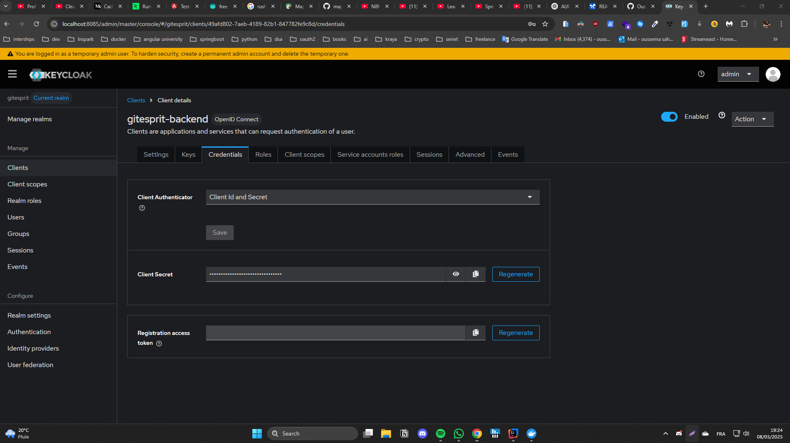
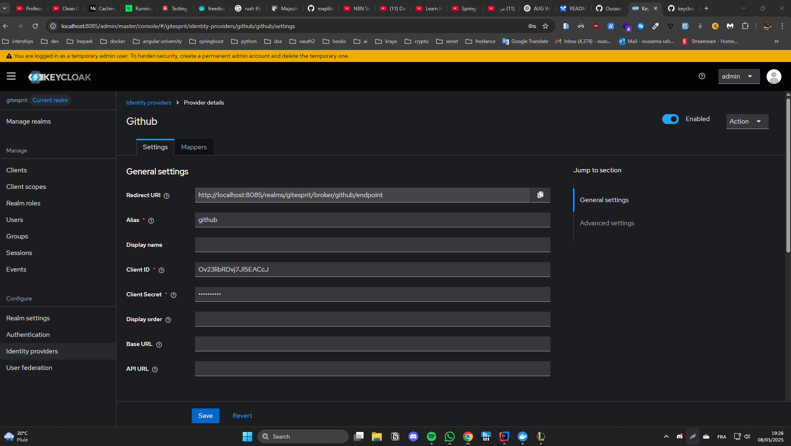
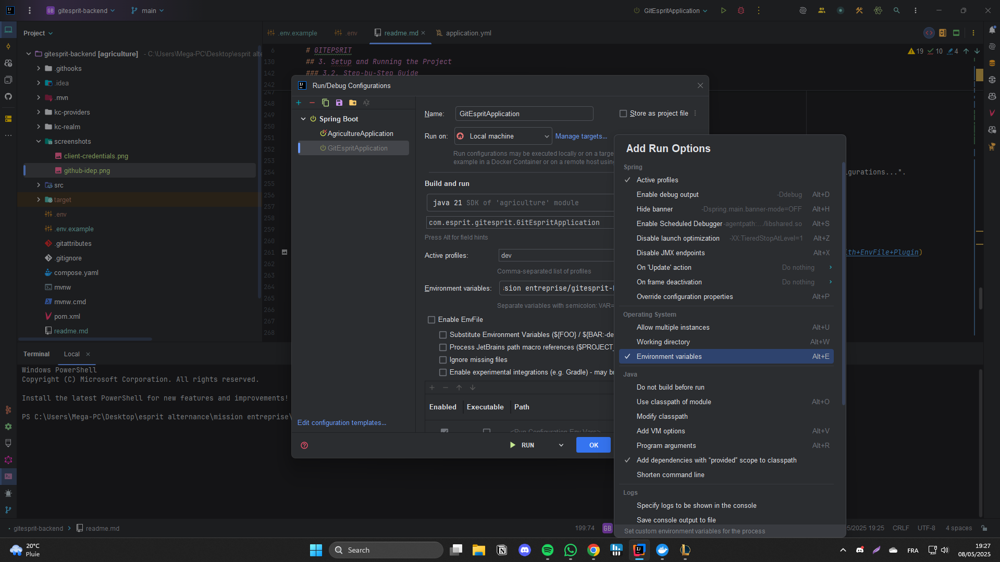
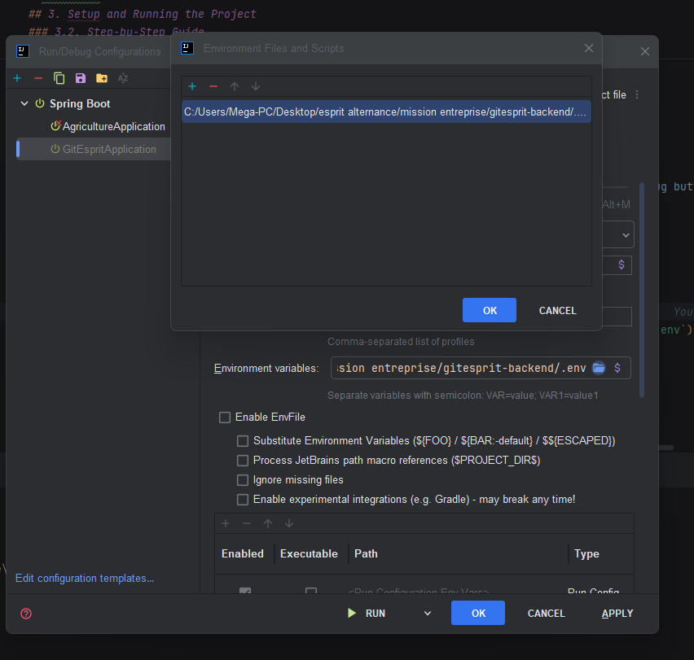

Okay, I've merged your provided README content with the Keycloak setup instructions. I've tried to integrate it logically, creating a main "Setup and Running the Project" section for the operational steps.

Here's the updated `README.md` content:

---
# GITEPSRIT

## Overview

This project is a Java application managed with Maven. It includes custom Keycloak providers, database initialization scripts, and monitoring configurations. It's a Spring Boot backend application secured using Keycloak for authentication and authorization.

## Table of Contents
1.  [Project Structure](#project-structure)
2.  [Requirements & Code Quality](#requirements--code-quality)
    *   [2.1. Activation des GitHooks](#21-activation-des-githooks)
    *   [2.2. Standardize code formatting with Spotless](#22-standardize-code-formatting-with-spotless)
3.  [Setup and Running the Project](#setup-and-running-the-project)
    *   [3.1. Prerequisites](#31-prerequisites)
    *   [3.2. Step-by-Step Guide](#32-step-by-step-guide)
        *   [3.2.1. Start Services with Docker Compose](#321-start-services-with-docker-compose)
        *   [3.2.2. Configure Keycloak](#322-configure-keycloak)
        *   [3.2.3. Create and Configure `.env` File](#323-create-and-configure-env-file)
        *   [3.2.4. Set Environment Variables in IntelliJ IDEA](#324-set-environment-variables-in-intellij-idea)
        *   [3.2.5. Run the Spring Boot Application](#325-run-the-spring-boot-application)
4.  [API Endpoints (Optional)](#api-endpoints-optional)


## 2. Requirements & Code Quality

### 2.1. Activation des GitHooks

To enable GitHooks in your project, run the following command:

```bash
chmod +x .githooks/*
chmod +x .githooks/scripts/*
git config core.hooksPath .githooks
```

This command sets the Git hooks path to `.githooks` for the current repository, where you can store your validation scripts.

### 2.2. Standardize code formatting with Spotless

The setup is really simple and comprises of only two steps no matter you use Maven or Gradle:

1.  Include the spotless dependency: `"com.diffplug.spotless"`
2.  Configure the plugin based on what your formatting preferences
3.  Make it part of build (optional but preferred)

Add the plugin to your `pom.xml` within the `<build><plugins>` section:
```xml
<plugin>
    <groupId>com.diffplug.spotless</groupId>
    <artifactId>spotless-maven-plugin</artifactId>
    <version>2.43.0</version> <!-- Use the latest appropriate version -->
    <configuration>
        <!-- optional: limit format enforcement to just the files changed by this feature branch -->
        <ratchetFrom>origin/develop</ratchetFrom>
        <java>
            <!--
              Define a sequence of steps that Spotless will apply to your Java files.
              See https://github.com/diffplug/spotless/tree/main/plugin-maven#java
            -->
            <includes>
                <include>src/main/java/**/*.java</include>
                <include>src/test/java/**/*.java</include>
            </includes>

            <!-- Apply import ordering -->
            <importOrder />

            <!-- Remove unused imports -->
            <removeUnusedImports />

            <!-- Support for // spotless:off and // spotless:on -->
            <toggleOffOn/>

            <!-- Trim trailing whitespace -->
            <trimTrailingWhitespace/>

            <!-- End files with a newline character -->
            <endWithNewline/>

            <!-- Configure indentation (example: using spaces) -->
            <!--
            <indent>
                <spaces>true</spaces>
                <spacesPerTab>4</spacesPerTab>
            </indent>
            -->
            <!-- Or using tabs as per your original example -->
            <indent>
                <tabs>true</tabs>
                <spacesPerTab>4</spacesPerTab>
            </indent>

            <!-- Apply Palantir Java Format (https://github.com/palantir/palantir-java-format) -->
            <palantirJavaFormat>
                <!-- <version>1.1.0</version> --> <!-- Optional: specify version -->
            </palantirJavaFormat>
            <!--
              You can add other formatters like googleJavaFormat, eclipseWtp, prettier, etc.
              <googleJavaFormat/>
            -->
        </java>
    </configuration>
    <executions>
        <execution>
            <goals>
                <goal>check</goal> <!-- or 'apply' to auto-format -->
            </goals>
            <phase>compile</phase> <!-- Run during the compile phase -->
        </execution>
    </executions>
</plugin>
```
*Note: I've added a version to `spotless-maven-plugin` and structured the configuration more explicitly. Adjust the version and formatting rules (like Palantir vs Google Java Format) as per your team's standards.*

To apply formatting:
```bash
./mvnw spotless:apply
```
To check formatting:
```bash
./mvnw spotless:check
```

## 3. Setup and Running the Project

Follow these steps to get the project up and running on your local machine.

### 3.1. Prerequisites

*   Docker & Docker Compose
*   Java JDK (e.g., 21 or newer)
*   Maven
*   IntelliJ IDEA (or your preferred IDE)
*   Git

### 3.2. Step-by-Step Guide

#### 3.2.1. Start Services with Docker Compose

This command will pull the necessary Docker images (like Keycloak, PostgreSQL, etc., as defined in your `docker-compose.yml`) and start the containers in detached mode.

First, clone the repository (if you haven't already) and navigate into the project directory:
```bash
git clone https://github.com/Oussemasahbeni/gitesprit-backend # If not already cloned
cd gitesprit-backend
```
```

Then, run Docker Compose:
```bash
docker compose up -d
```

To check if the containers are running:
```bash
docker ps
```
You should see Keycloak and any other services (e.g., a database) listed.

#### 3.2.2. Configure Keycloak

##### 3.2.2.1 Access Keycloak Admin Console

1.  Open your web browser and navigate to the Keycloak admin console. This is typically `http://localhost:8080`.
    *   *Note: The port might differ based on your `docker-compose.yml` configuration for Keycloak.*
2.  Log in with the admin credentials.
    *   Default credentials are often `admin/admin`. Check your `docker-compose.yml` or Keycloak setup for the exact credentials if they differ.

##### 3.2.2.2 Obtain Keycloak Client Secret for `gitesprit-backend`

The Spring Boot application acts as a client to Keycloak. You need to get its secret.

1.  Once logged into Keycloak, select your Realm (e.g., `gitesprit-realm`, `master`, or whatever realm your application is configured to use). If you imported a realm, select that one.
2.  Navigate to **Clients** from the left-hand menu.
3.  Find and click on the client ID named `gitesprit-backend` (or the client ID configured for your Spring Boot application).
4.  Go to the **Credentials** tab.
5.  You will see a field labeled "Client Secret". Copy this value. You will need it for the `.env` file.

    
    *(Screenshot Placeholder: Keycloak Client -> `gitesprit-backend` -> Credentials Tab showing the Client Secret)*

##### 3.2.2.3 Update GitHub Identity Provider Client Secret (If Applicable)

If your Keycloak setup uses GitHub as an Identity Provider (for social login), you need to ensure its Client Secret is correctly configured in Keycloak. This secret comes from your GitHub OAuth Application settings.

1.  In the Keycloak Admin Console (for your selected Realm), navigate to **Identity Providers** from the left-hand menu.
2.  Select the **GitHub** provider from the list (or the name you gave it).
3.  Scroll down to find the "Client secret" field.
4.  Paste the **actual Client Secret obtained from your GitHub OAuth App's settings page** into this field.
    *   *Where to find it in GitHub: Your GitHub Account -> Settings -> Developer settings -> OAuth Apps -> Your App Name.*
5.  Click **Save**.

    
    *(Screenshot Placeholder: Keycloak Identity Providers -> GitHub -> Client Secret field)*

#### 3.2.3. Create and Configure `.env` File

The application uses a `.env` file to manage environment-specific configurations, especially secrets.

1.  In the root directory of your Spring Boot project, create a file named `.env`.
2.  Add the following content to it, replacing placeholders with your actual values. The `KEYCLOAK_CLIENT_SECRET` is the one you copied in the previous step.

    ```env
    # Database Configuration
    DB_URL=
    DB_USERNAME=
    DB_PASSWORD=
    # Mail Configuration
    MAIL_HOST=
    MAIL_PORT=
    MAIL_USERNAME=
    MAIL_PASSWORD=
    # Keycloak Configuration
    OAUTH2_ISSUER_URI=
    KEYCLOAK_CLIENT_ID=
    KEYCLOAK_CLIENT_SECRET=
    KEYCLOAK_REALM=
    KEYCLOAK_URL=
    # General Configuration
    FRONTEND_URL=
    CORS_ALLOWED_ORIGINS=
    BACKEND_URL=
    # Azure Storage Configuration
    AZURE_ACCOUNT_NAME=
    AZURE_ACCOUNT_KEY=
    AZURE_CONNECTION_STRING=
    AZURE_ENDPOINT=
    ```

3.  **Important:** Ensure `.env` is listed in your `.gitignore` file to prevent committing secrets to your repository. If not already present, add `.env` to your `.gitignore` file:
    ```gitignore
    # .env file
    .env
    ```

#### 3.2.4. Set Environment Variables in IntelliJ IDEA

IntelliJ IDEA needs to be configured to load the variables from the `.env` file when running or debugging your application.

#### 3.2.4. Set Environment Variables in IntelliJ IDEA

IntelliJ IDEA needs to be configured to load the variables from the `.env` file (or for you to manually input them) when running or debugging your application.

**Setting Environment Variables via Run/Debug Configurations:**

1.  **Open Run/Debug Configurations:**
    *   Click on the current run configuration (usually near the top right, next to the play/debug buttons) and select "**Edit Configurations...**".

    
    *(Screenshot Placeholder: Dropdown menu showing "Edit Configurations...")*

2.  **Select Your Application:**
    *   In the Run/Debug Configurations dialog, select your Spring Boot application configuration from the list on the left.

3.  **Access Environment Variables:**
    *   Look for the "**Modify options**" link/dropdown usually located towards the top right or bottom of the configuration pane for your selected application. Click it.
    *   In the dropdown that appears, check or select "**Environment variables**". This will make the "Environment variables" field visible if it wasn't already.

    
    *(Screenshot Placeholder: IntelliJ "Modify options" dropdown with "Environment variables" highlighted/selected)*

    
IntelliJ will now use these environment variables when you run or debug this specific configuration. Remember to update these if your `.env` file changes or if you add new variables.


#### 3.2.5. Run the Spring Boot Application

You can now build and run your Spring Boot application:

**Using Maven (from the project root directory):**
```bash
./mvnw spring-boot:run
# or if you don't have the wrapper:
# mvn spring-boot:run
```

**Or, directly from IntelliJ IDEA:**
*   Open your main application class (the one annotated with `@SpringBootApplication`).
*   Right-click inside the editor and select "Run 'YourApplicationName'" or "Debug 'YourApplicationName'".
*   Alternatively, use the play/debug buttons in the top right corner, ensuring your application's run configuration is selected.

The application should start, typically on `http://localhost:8082`. Check the console logs for any errors and for the startup message indicating the application is running.


---